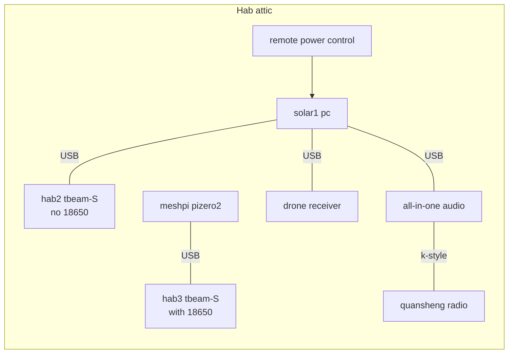

# MDRS field topology

Hosts and Meshtastic gateway nodes at MDRS.

```mermaid
flowchart LR
    subgraph attic [Hab attic]
        H2["hab2 tbeam-S<br/>no 18650"]
        RR[remote power control]
        S1[solar1 pc]
        MP[meshpi pizero2]
        H3["hab3 tbeam-S<br/>with 18650"]
        DR[drone receiver]
        AUDIO[all-in-one audio]
        QS[quansheng radio]

        RR --> S1
        S1 -- USB --- H2
        MP -- USB --- H3
        S1 -- USB --- DR
        S1 -- USB --- AUDIO
        AUDIO -- k-style --- QS
    end
```
